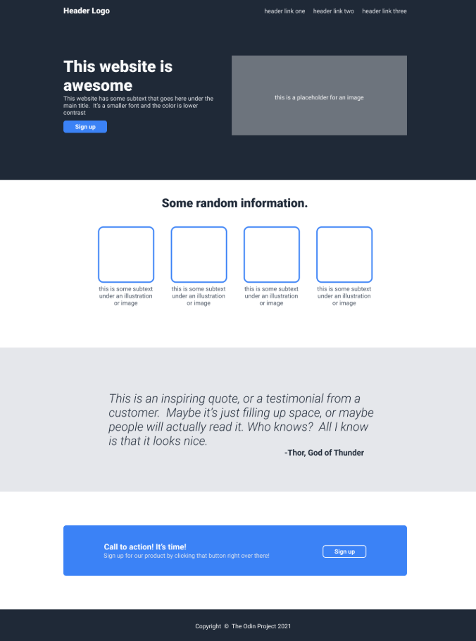

# Landing Page 

This is my landing page project from The Odin Project, and it was a fun and exciting journey to put my knowledge into practice and challenge myself! I often referred to resources online to understand how to approach certain tasks, and I realized that learning takes time. I look forward to learning more and building more projects!

## Features

- Built using basic HTML structure based on the provided reference

- Styled with CSS to enhance the visual appearance of the page

- Utilized Flexbox to position and manage elements effectively

## Landing Page Preview

## What I Learned 

- Flexbox alignment

- Use of margin and padding

- Structuring HTML clearly 

- Using git for version control

